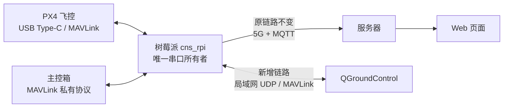
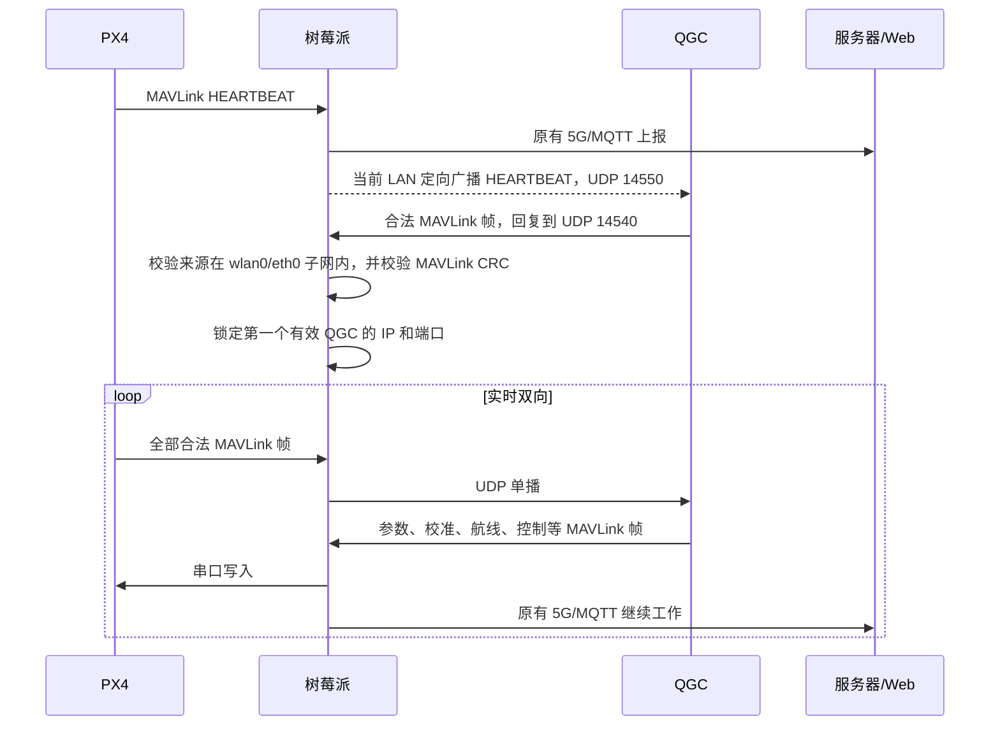

# QGC 局域网自动连接与 5G 并行方案

## 1. 最终目标

一台树莓派只连接一台设备，设备可能是：

- 主控箱：继续按原协议解析，通过 5G/MQTT 上报服务器和 Web。
- PX4 真实飞控：继续通过 5G/MQTT 上报服务器和 Web，同时允许同一局域网内的 QGroundControl（QGC）实时连接、校准、读取参数、上传航线和控制飞控。

切换路由器或 Wi-Fi 后，不在 QGC 和树莓派中写死 IP。只要两者位于一个可互通、未开启客户端隔离的局域网，就自动重新发现。

## 2. 推荐架构



核心原则：

1. `cns_rpi` 仍是 `/dev/ttyACM0` 或其他 MAVLink 串口的唯一所有者。
2. 不启动第二个程序抢占串口，不引入 `mavlink-router` 串口竞争。
3. PX4 上行的每个合法 MAVLink 帧同时进入两条互不阻塞的支路：
   - 原解析、状态缓存、5G/MQTT、服务器、Web 支路；
   - 局域网 UDP、QGC 支路。
4. QGC 下行的合法 MAVLink 帧只写回飞控串口，不写入树莓派 `StateStore`，不会污染设备 ID、RID 或遥测状态。
5. 主控箱接入时不启动 QGC 桥接。

## 3. 自动发现过程



自动适配新网络的方法：

- 树莓派每秒从 `wlan0`、`eth0` 重新读取 IP、掩码和广播地址。
- 没有 QGC 时，只以 1 Hz 广播 PX4 的 `HEARTBEAT`，不广播全部高频数据。
- 第一个返回合法 MAVLink 帧且来源属于当前 LAN 子网的 QGC 被选中。
- 连接建立后，全部 PX4 MAVLink 帧改为发给该 QGC 的 UDP 单播。
- 连续 5 秒未收到该 QGC 的合法 MAVLink 帧，清除旧地址并恢复广播发现。
- Wi-Fi 地址变化、网线切换或换路由器后，无需修改配置、无需重启服务。

## 4. 配置

现有配置文件不包含 `qgc_udp` 时，功能默认关闭，行为与修改前完全一致。需要启用时加入：

```json
{
  "qgc_udp": {
    "enabled": true,
    "mode": "auto_discovery",
    "lan_interfaces": ["wlan0", "eth0"],
    "listen_port": 14540,
    "qgc_port": 14550,
    "discovery_interval_ms": 1000,
    "peer_timeout_ms": 5000,
    "allow_commands": true
  }
}
```

字段说明：

| 字段 | 作用 |
|---|---|
| `enabled` | 总开关；回滚时设为 `false` |
| `lan_interfaces` | 只允许 QGC 使用这些局域网接口；不包含 5G 的 `usb0` |
| `listen_port` | 树莓派接收 QGC 数据的 UDP 端口 |
| `qgc_port` | QGC 默认监听端口 |
| `discovery_interval_ms` | 未连接时 HEARTBEAT 发现周期 |
| `peer_timeout_ms` | QGC 无有效 MAVLink 数据后的释放时间 |
| `allow_commands` | `false` 时只看遥测；`true` 时允许校准、参数和控制下发 |

推荐先用 `allow_commands: false` 验证实时显示，再在拆除螺旋桨、确保飞控未解锁的条件下改为 `true` 验证校准和控制。

## 5. QGroundControl 设置

QGC 只需做一次：

1. 打开 `Application Settings → Comm Links`。
2. 启用 UDP 自动连接，QGC 本地监听端口使用 `14550`。
3. 不填写固定树莓派 IP。
4. 不启用 `High Latency` 模式。

Windows 防火墙需要允许 QGroundControl 接收 UDP `14550`，建议范围限制为“专用网络/本地子网”。

## 6. 不影响原功能的隔离措施

| 场景 | 预期行为 |
|---|---|
| 接入主控箱 | QGC UDP 桥接不启动；主控箱解析和 5G/MQTT 完全按原逻辑 |
| 接入 PX4，但没有 QGC | 仅 1 Hz 局域网发现包；5G/Web 正常 |
| QGC 关闭或防火墙拦截 | 5G/MQTT、服务器、Web 不受影响 |
| 5G 断开 | 局域网 QGC 仍可工作 |
| Wi-Fi 断开 | QGC 暂时断开；5G 链路继续工作 |
| 换路由器/换网段 | 树莓派重算广播地址并自动发现，无需改 IP |
| UDP 发送缓存满或网络错误 | 当前 UDP 帧直接丢弃，不阻塞串口和 MQTT |
| 第二台 QGC 加入 | 第一台有效 QGC 未超时前拒绝第二台，避免双重控制 |
| 非 LAN 来源或 CRC 错误帧 | 丢弃，不写入飞控 |

桥接建立后，串口轮询等待上限从约 100 ms 降为 5 ms，使 QGC 指令能更快进入飞控；MQTT 遥测发布周期不变。

## 7. 能力和边界

在网络质量正常的同一局域网内，QGC 可以获得接近直接 USB 连接的能力：

- 实时姿态、状态、GPS、电池和告警显示；
- 参数读取与设置；
- 传感器、遥控器等常规校准；
- 航线读取、上传和执行；
- 模式切换、解锁及其他 MAVLink 控制。

以下情况不保证：

- PX4 固件刷写和 Bootloader 操作通常仍需要 QGC 电脑直接 USB 连接飞控。
- 同一 Wi-Fi 名称不代表一定互通。访客 Wi-Fi、AP/客户端隔离、不同 VLAN 或防火墙可能阻止 UDP。
- MAVLink CRC 只保证帧完整性，不等于身份认证。控制网络必须是可信局域网；本方案不会在公网或 5G `usb0` 上开放 QGC 端口。
- 局域网实时链路目标通常为约 30–50 ms，但最终时延取决于 Wi-Fi、QGC 电脑和飞控消息频率。

## 8. 验收清单

部署前拆除螺旋桨并保持飞控未解锁，然后逐项验证：

- [ ] 主控箱接入时，原设备 ID、RID、遥测、MQTT topic 和 Web 显示均正常。
- [ ] PX4 接入时，设备 ID、RID（飞控实际发送时）和遥测继续通过 5G 到 Web。
- [ ] QGC 不配置树莓派 IP 即可在同一 LAN 自动出现飞控。
- [ ] QGC 姿态显示连续，参数可以完整读取。
- [ ] `allow_commands: false` 时 QGC 下行不进入飞控。
- [ ] `allow_commands: true` 时参数、校准和航线上传正常。
- [ ] 关闭 QGC 后约 5 秒恢复自动发现；再次打开可以重连。
- [ ] 换到另一台路由器、IP 网段变化后无需改配置即可重连。
- [ ] 断开 Wi-Fi 时 5G/Web 仍工作；断开 5G 时局域网 QGC 仍工作。
- [ ] PX4 或 USB 拔插后服务可以重新发现飞控并恢复两条链路。

## 9. 回滚

将配置改为：

```json
{
  "qgc_udp": {
    "enabled": false
  }
}
```

然后重启 `cns-rpi.service`。代码会回到原串口解析和 5G/MQTT 行为。旧配置中完全没有 `qgc_udp` 段时也默认关闭，因此旧现场配置兼容。
