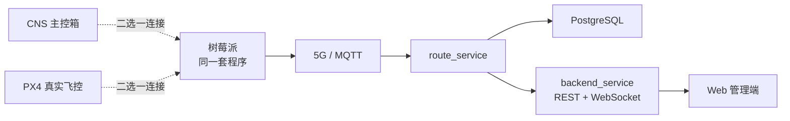
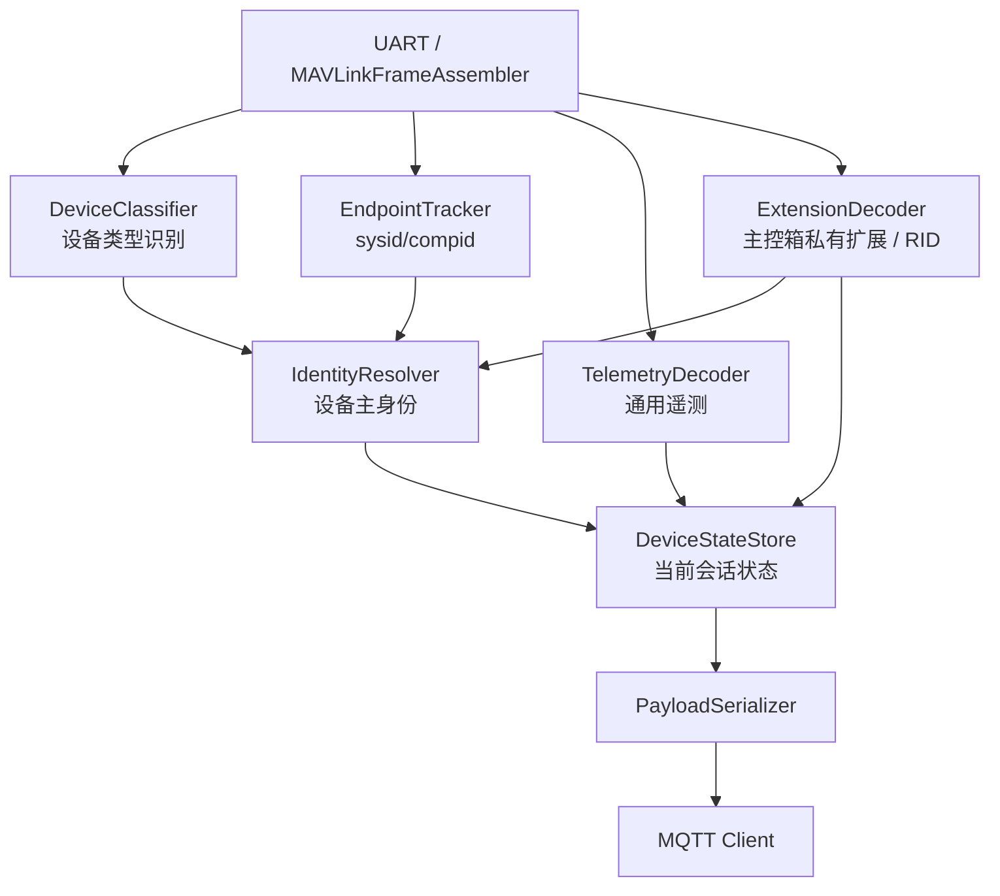
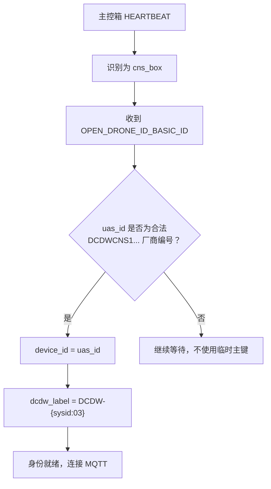
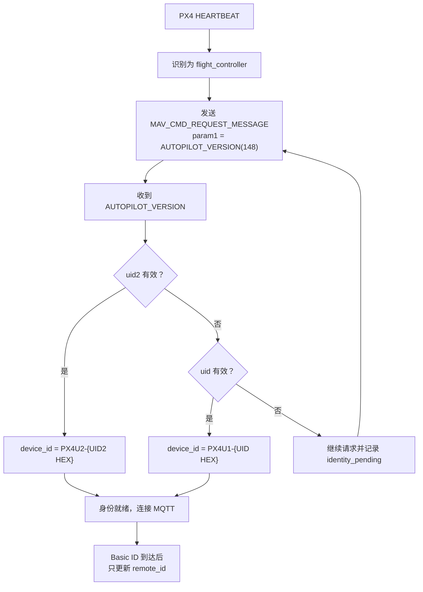
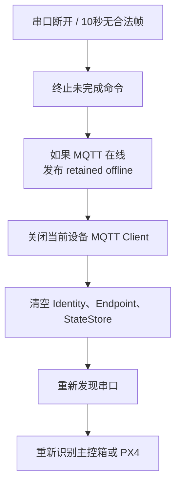
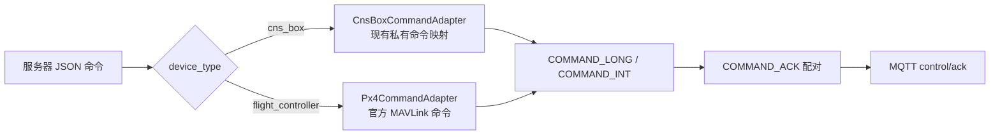
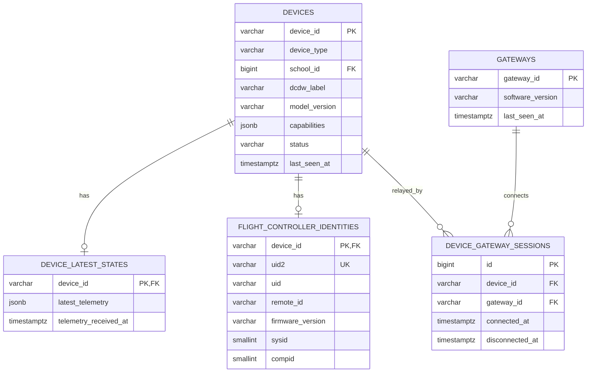
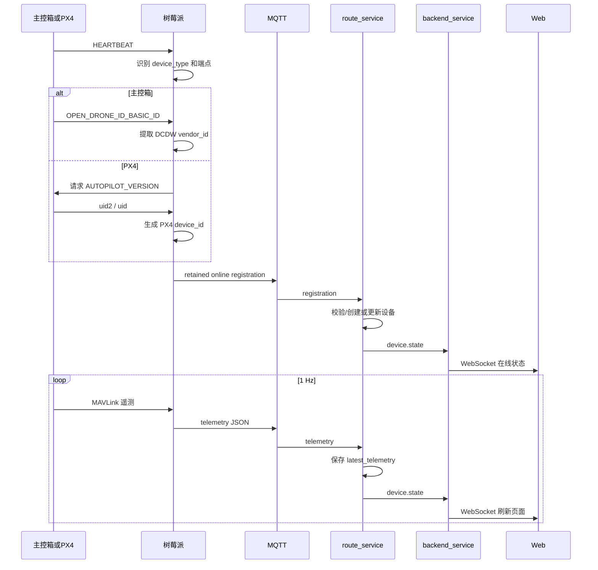

# 主控箱与 PX4 单设备兼容接入设计

版本：2026-07-29

状态：审查修订后的推荐方案

适用系统：`cns_rpi`、`cns_server`、Web 管理端

---

## 1. 最终场景

同一套树莓派程序，一次只连接一个受控设备，但连接的设备可能是：

1. 现有 CNS 主控箱（STM32）；
2. 真实 PX4 飞控。

树莓派必须自动或按配置识别当前设备，解析对应身份、Remote ID 和遥测，通过 5G/MQTT 上传服务器，最终显示在 Web 端。



本设计不支持把主控箱和 PX4 同时接到同一树莓派；如果以后需要同时连接，应再拆成两个独立 `DeviceSession`。

---

## 2. 最重要的设计结论

### 2.1 树莓派只是网关

服务器中的受控设备是主控箱或 PX4，树莓派只负责：

- UART/MAVLink 收发；
- 设备类型识别；
- 身份与遥测解析；
- 命令转发和 ACK 配对；
- 5G/MQTT 通信。

树莓派 CPU Serial 只能作为 `gateway_id`，不能代替受控设备主键。

### 2.2 两类设备使用不同的主身份

| 设备类型 | 服务器 `device_id` 来源 | Remote ID 来源 |
|---|---|---|
| `cns_box` | `OPEN_DRONE_ID_BASIC_ID.uas_id` 中的 20 字符厂商编号 | 同一个 Basic ID 数据 |
| `flight_controller` | `AUTOPILOT_VERSION.uid2`，回退 `uid` | `OPEN_DRONE_ID_BASIC_ID.uas_id` |

关键区别：

```text
主控箱：
OPEN_DRONE_ID_BASIC_ID.uas_id
  └─ 是主控箱厂商唯一编号，也可作为 device_id

PX4：
AUTOPILOT_VERSION.uid2 / uid
  └─ 是飞控硬件 device_id

OPEN_DRONE_ID_BASIC_ID.uas_id
  └─ 只是 PX4 的 Remote ID，不能覆盖 device_id
```

### 2.3 一个通用设备主键

服务器统一使用 `device_id`：

```text
主控箱：
DCDWCNS1S2MEAG1VTA0C

PX4，优先 uid2：
PX4U2-00112233445566778899AABBCCDDEEFF0011

PX4，回退 uid：
PX4U1-0123456789ABCDEF
```

- `PX4U2-` 表示来自 `uid2`；
- `PX4U1-` 表示来自旧版 `uid`；
- 十六进制统一大写；
- 同一 PX4 更换树莓派后，`device_id` 不变。

---

## 3. 当前代码不能直接满足目标

现有树莓派代码主要面向主控箱，必须修改以下行为：

| 当前行为 | 对 PX4 的问题 | 必须修改为 |
|---|---|---|
| 只接受 `compid=193`、`MAV_TYPE_ONBOARD_CONTROLLER` | 无法学习 PX4 端点 | 同时支持主控箱端点和 PX4 autopilot 端点 |
| 收到 Basic ID 就无条件 `UpdateVendorId()` | 会把 PX4 RID 错当成硬件主键 | 先识别设备类型，再决定 Basic ID 的语义 |
| 每帧都根据 `sysid` 生成 `DCDW-XXX` | PX4 会被错误显示成 `DCDW-001` | 只在 `cns_box` 模式生成角色号 |
| 没有 `AUTOPILOT_VERSION` 业务解码 | 无法获得 PX4 `uid2/uid` | 增加请求、解析和状态存储 |
| 串口断开后保留旧 `StateStore` | 换接设备可能沿用旧身份和旧遥测 | 断开时离线、清空会话状态并重新识别 |
| JSON 没有明确 `device_type` | 服务端和 Web 无法决定校验/展示方式 | 新协议增加 `device_type` |

现有服务器和 Web 也不能直接显示 PX4：

- topic 设备 ID 固定要求 20 个字母数字；
- registration 只接受 `schema_version=1`；
- online registration 强制要求 `school_name`；
- 数据库 `devices.school_id NOT NULL`；
- route_service 拒绝数据库中不存在的设备；
- backend schema 强制 `school_name` 非空；
- Web 列表和详情默认按“学校、角色号、主控箱型号”展示；
- Web 对所有设备都显示主控箱电机 PWM 和私有命令。

因此必须同时修改树莓派、route_service、数据库、backend 和 frontend，不能只改文档中的 JSON 示例。

---

## 4. 树莓派内部结构

建议把现有“收到消息就直接写身份”的结构改为一个明确的设备会话：



建议核心数据结构：

```cpp
enum class DeviceType {
  kUnknown,
  kCnsBox,
  kFlightController,
};

struct DeviceIdentity {
  DeviceType type;
  std::string device_id;
  std::optional<std::string> box_vendor_id;
  std::optional<std::string> px4_uid2;
  std::optional<std::string> px4_uid;
  std::optional<std::string> remote_id;
  std::optional<std::string> dcdw_label;
  std::optional<std::string> school_name;
  std::uint8_t system_id;
  std::uint8_t component_id;
};
```

一个串口连接周期对应一个 `DeviceSession`。设备身份一旦确定，在当前会话内锁定，不能被另一条普通 MAVLink 消息随意改写。

---

## 5. 设备类型识别

配置增加：

```json
{
  "device": {
    "mode": "auto"
  }
}
```

允许值：

| 配置 | 行为 |
|---|---|
| `auto` | 根据 HEARTBEAT 自动识别，默认值 |
| `cns_box` | 现场明确接主控箱时强制使用 |
| `px4` | 现场明确接 PX4 时强制使用 |

保留强制模式是为了处理定制固件 HEARTBEAT 不标准或链路中出现多个 MAVLink 组件的情况。

### 5.1 自动识别主控箱

满足现有主控箱特征：

```text
HEARTBEAT.type = MAV_TYPE_ONBOARD_CONTROLLER
message.compid = 193
```

识别结果：

```text
device_type = cns_box
目标端点 = 当前消息 sysid / compid
```

### 5.2 自动识别 PX4

优先判断：

```text
HEARTBEAT.autopilot = MAV_AUTOPILOT_PX4
```

识别结果：

```text
device_type = flight_controller
目标端点 = PX4 autopilot HEARTBEAT 的 sysid / compid
```

摄像头、云台、Remote ID 模块等 HEARTBEAT 不能抢占 autopilot 主端点。

### 5.3 冲突处理

如果同一串口会话同时出现主控箱和 PX4 两套主端点特征：

- 不自动选择；
- 记录 `ambiguous_device_type`；
- 不建立正式设备 MQTT topic；
- 要求现场检查接线或使用强制模式。

---

## 6. 两类身份解析流程

### 6.1 主控箱



主控箱继续保留：

- `school_name`：来自部署配置；
- `dcdw_label`：由主控箱端点 `sysid` 格式化；
- 主控箱私有模块、LoRa、电机、告警和日志扩展。

### 6.2 PX4



PX4 的 Remote ID 允许为 `null`，不阻止身份注册和遥测上传。

---

## 7. MAVLink 消息归属过滤

识别出主端点后，不能把串口上的所有组件消息都无条件写入当前状态。

规则：

1. 主身份消息 `AUTOPILOT_VERSION` 必须来自已学习的 PX4 autopilot 端点；
2. 通用飞行遥测必须来自当前锁定的 `system_id`；
3. 命令 ACK 必须来自当前目标端点，并匹配当前命令号；
4. `OPEN_DRONE_ID_*` 可以来自同一 `system_id` 下的 RID 组件；
5. 不同 `system_id` 的消息不进入当前设备快照；
6. 切换串口或重新发现后必须重新学习，不能沿用旧端点。

这可以避免摄像头、云台或附近另一套 MAVLink 系统污染身份和遥测。

---

## 8. 串口断开和换接设备

当前代码断开串口时不能只清除 `stm32_endpoint`，还必须结束整个设备会话。



必须新增：

```cpp
DeviceSession::Reset();
StateStore::Reset();
```

这样树莓派从主控箱换接 PX4，或者从 PX4 换接另一台 PX4 时，不会继续上传上一台设备的身份、GPS 或电池数据。

---

## 9. 统一 MQTT Topic

两种设备使用同一套 topic 结构：

```text
cns_rpi/{device_id}/registration
cns_rpi/{device_id}/telemetry
cns_rpi/{device_id}/config/set
cns_rpi/{device_id}/config/ack
cns_rpi/{device_id}/control/set
cns_rpi/{device_id}/control/ack
```

示例：

```text
主控箱：
cns_rpi/DCDWCNS1S2MEAG1VTA0C/telemetry

PX4：
cns_rpi/PX4U2-00112233445566778899AABBCCDDEEFF0011/telemetry
```

建议 QoS：

| Topic | QoS | Retain |
|---|---:|---:|
| registration | 2 | true |
| telemetry | 0 | false |
| config/set、config/ack | 2 | false |
| control/set、control/ack | 2 | false |

---

## 10. 协议版本与兼容策略

### 10.1 新树莓派统一发送 schema v2

无论接主控箱还是 PX4，新程序都发送统一外壳：

```json
{
  "schema_version": 2,
  "device_id": "设备主键",
  "device_type": "cns_box 或 flight_controller"
}
```

这里的 v2 是“设备 MQTT 注册/遥测协议版本”。backend 的 REST/WebSocket
协议可以同步升级，也可以保留独立版本号，不能因为名字相同就把两者当成同一个版本常量。

### 10.2 服务器继续接受旧 schema v1

为兼容已经部署的旧主控箱树莓派：

```text
旧 schema v1：
vendor_id -> 内部转换为 device_id
device_type -> 默认为 cns_box

新 schema v2：
直接读取 device_id 和 device_type
```

服务器内部统一转换成 v2 领域模型，不要让两套逻辑一直扩散到数据库和 Web。

---

## 11. 注册消息

### 11.1 主控箱 registration

```json
{
  "schema_version": 2,
  "device_id": "DCDWCNS1S2MEAG1VTA0C",
  "device_type": "cns_box",
  "status": "online",
  "capabilities": [
    "telemetry",
    "remote_id",
    "runtime_config",
    "box_private_control"
  ],
  "identity": {
    "vendor_id": "DCDWCNS1S2MEAG1VTA0C",
    "dcdw_label": "DCDW-001",
    "school_name": "SEU",
    "remote_id": {
      "uas_id": "DCDWCNS1S2MEAG1VTA0C",
      "id_type": 1,
      "ua_type": 2
    }
  },
  "endpoint": {
    "sysid": 1,
    "compid": 193,
    "mavlink_version": 2
  },
  "gateway": {
    "gateway_id": "10000000ABCDEF01",
    "software_version": "cns_rpi-2.0.0",
    "connection": "5g"
  }
}
```

### 11.2 PX4 registration

```json
{
  "schema_version": 2,
  "device_id": "PX4U2-00112233445566778899AABBCCDDEEFF0011",
  "device_type": "flight_controller",
  "status": "online",
  "capabilities": [
    "telemetry",
    "remote_id",
    "px4_official_control"
  ],
  "identity": {
    "uid2": "00112233445566778899AABBCCDDEEFF0011",
    "uid": "0123456789ABCDEF",
    "remote_id": null,
    "autopilot": "PX4",
    "firmware_version": "1.17.0",
    "hardware_vendor_id": 0,
    "hardware_product_id": 0
  },
  "endpoint": {
    "sysid": 1,
    "compid": 1,
    "mavlink_version": 2
  },
  "gateway": {
    "gateway_id": "10000000ABCDEF01",
    "software_version": "cns_rpi-2.0.0",
    "connection": "5g"
  }
}
```

PX4 后续收到 Remote ID 时重新发布 retained online registration，但 `device_id` 不改变。

---

## 12. 统一遥测消息

两种设备尽量复用现有 Web 已能读取的字段路径：

```json
{
  "schema_version": 2,
  "device_id": "PX4U2-00112233445566778899AABBCCDDEEFF0011",
  "device_type": "flight_controller",
  "sent_at": "2026-07-29T10:00:00+08:00",
  "identity": {
    "remote_id": "RID123456789ABCDEFG"
  },
  "telemetry": {
    "heartbeat": {
      "type": 2,
      "autopilot": 12,
      "base_mode": 81,
      "custom_mode": 65536,
      "system_status": 3,
      "mavlink_version": 3
    },
    "attitude": {
      "roll": 0.6,
      "pitch": -1.2,
      "yaw": 90.0
    },
    "gps": {
      "lat": 31.1234567,
      "lon": 121.1234567,
      "alt": 18.5,
      "fix_type": 3,
      "satellites_visible": 15
    },
    "global_position": {},
    "sys_status": {},
    "battery": {},
    "cellular_5g": {}
  },
  "drone_id": {
    "basic_id": {},
    "location": {},
    "system": {},
    "operator_id": {},
    "self_id": {}
  }
}
```

约定：

- `telemetry.attitude.roll/pitch/yaw` 继续使用当前树莓派输出的角度制；
- 经纬度继续使用十进制度；
- 高度继续使用米；
- 无效 MAVLink 哨兵值转换为 `null`；
- 主控箱私有数据继续放在现有 `modules`、`alarms`、`logs` 和对应 `telemetry` 分支；
- PX4 没有主控箱私有扩展时字段自然缺失；
- Web 对缺失字段显示“暂无数据”，不能显示为故障或 0。

---

## 13. 树莓派需要新增或调整的 MAVLink 支持

### 13.1 通用消息

继续支持：

- `HEARTBEAT`
- `GPS_RAW_INT`
- `ATTITUDE`
- `GLOBAL_POSITION_INT`
- `SYS_STATUS`
- `BATTERY_STATUS`
- `SCALED_PRESSURE`

建议增加：

- `EXTENDED_SYS_STATE`

### 13.2 PX4 身份

新增：

- 主动发送 `MAV_CMD_REQUEST_MESSAGE`；
- 请求 `AUTOPILOT_VERSION`，消息 ID 148；
- 解码 `uid2`、`uid`、固件版本、硬件 vendor/product；
- 根据 `uid2/uid` 生成稳定 `device_id`。

### 13.3 Remote ID

现有 `OPEN_DRONE_ID_*` 解码可复用，但必须修改身份写入：

```text
cns_box：
Basic ID.uas_id -> box vendor_id + remote_id

flight_controller：
Basic ID.uas_id -> remote_id
绝对不能 UpdateDeviceId()
```

### 13.4 MAVLink 版本

PX4 v1.17 明确配置：

```text
MAV_PROTO_VER = 2
```

因为 `OPEN_DRONE_ID_*` 的消息 ID 大于 255，需要 MAVLink 2。

---

## 14. 命令和 ACK

两类设备共用命令事务状态机，但使用不同命令适配器：



要求：

- 主控箱保留现有私有命令；
- PX4 只发送 PX4 支持的官方 MAVLink 命令；
- 主控箱私有 `set_motor_pwm` 不能直接发给 PX4；
- ACK 匹配 `command + sysid + compid`；
- MQTT `command_id` 用于幂等，避免重复执行；
- 设备类型不支持的命令返回 `unsupported_device_type`。

---

## 15. 服务端设备模型

服务器使用通用 `devices` 表，不再假设所有设备都有学校和角色号：



字段约束：

| 字段 | `cns_box` | `flight_controller` |
|---|---|---|
| `device_id` | 必填 | 必填 |
| `school_id` | 必填 | 可空 |
| `dcdw_label` | 建议必填 | 可空 |
| `uid2/uid` | 不使用 | 至少一个有效 |
| `remote_id` | 必填或按现状等待 | 可空、允许后补 |

旧数据库迁移：

```text
旧 devices.vendor_id -> 新 devices.device_id
旧设备 device_type = cns_box
旧 school_id、dcdw_label 保持不变
```

---

## 16. 新设备注册与安全

当前 route_service 会拒绝数据库中不存在的设备。PX4 的 UID 通常要接入后才知道，因此必须设计首次注册。

推荐规则：

1. 主控箱继续使用现有预配机制；
2. 未知 PX4 的合法 schema v2 registration 可以创建 `flight_controller` 记录；
3. telemetry 永远不能创建未知设备；
4. PX4 首次注册必须来自受信任树莓派 MQTT 凭据和 broker ACL；
5. 生产环境必须使用 TLS、每网关独立凭据和 topic ACL；
6. 如果暂时没有网关鉴权，PX4 应先进入 `pending`，Web 可见但禁止命令，人工确认后启用。

不能在公网 MQTT 匿名连接下无条件自动创建任意设备。

---

## 17. route_service 修改

1. 将 `vendor_id` 领域概念升级为通用 `device_id`；
2. `device_id` 最大长度放宽到 64；
3. 只接受两类规范格式：
   - 主控箱：20 字符字母数字，且符合厂商规则；
   - PX4：`PX4U2-` + 36 位 HEX，或 `PX4U1-` + 16 位 HEX；
4. topic 仍保持三段式，不需要增加子设备层级；
5. registration 同时解析 schema v1/v2；
6. v1 转换为内部 v2 `cns_box` 模型；
7. v2 校验 topic `device_id` 与 payload 一致；
8. 允许 `flight_controller` 没有学校和角色号；
9. registration 更新飞控身份和网关会话；
10. telemetry 保存完整 JSONB 最新快照；
11. 状态事件增加 `device_id`、`device_type`、可空学校/角色号；
12. 保存或根据设备类型计算 `capabilities`；
13. 命令路由改为按 `device_id`。

---

## 18. backend_service 修改

1. `DeviceIdSchema` 支持主控箱和 PX4 两种格式；
2. `DeviceSummary` 增加 `device_type`；
3. `school_name` 和 `dcdw_label` 改为可空；
4. REST 路由改为 `/api/devices/:device_id`；
5. 查询数据库时对学校使用 `LEFT JOIN`；
6. 搜索同时覆盖：
   - `device_id`
   - 主控箱角色号和学校
   - PX4 `uid2/uid`
   - Remote ID
7. 详情接口返回飞控身份、网关和能力；
8. WebSocket `device.state` 使用 `device_id`；
9. 命令协议根据 `device_type/capabilities` 校验支持范围。

---

## 19. Web 端修改

当前 Web 默认所有设备都是主控箱，必须按 `device_type` 分支显示。

### 19.1 设备列表

| 主控箱 | PX4 |
|---|---|
| 标题：`DCDW-001` | 标题：`PX4 飞控` 或自定义名称 |
| 副标题：厂商 `device_id` | 副标题：PX4 `device_id` |
| 学校：实际学校 | 学校：未归属或后台分配 |
| 型号：CNS 型号 | 型号：PX4 + 固件版本 |

增加设备类型筛选：

```text
全部 / 主控箱 / PX4飞控
```

### 19.2 设备详情

公共区域：

- 在线状态；
- 最后活跃；
- GPS、地图、姿态、电池；
- 5G 链路；
- Remote ID；
- 原始最新遥测。

主控箱专属区域：

- 学校、角色号；
- 模块自检；
- LoRa；
- 四路 PWM；
- 主控箱告警和日志；
- 主控箱私有控制按钮。

PX4 专属区域：

- `uid2/uid`；
- PX4 固件版本；
- `sysid/compid`；
- 飞行模式、解锁状态；
- PX4 支持的官方命令；
- 不显示主控箱 PWM 私有控制。

### 19.3 遥测字段兼容

树莓派继续输出现有公共字段路径后，Web 当前 GPS、地图、姿态、电池映射大部分可以复用。

仍需补充：

- `telemetry.attitude.*` 单位明确为度；
- PX4 飞行模式和 armed 状态映射；
- PX4 Remote ID 身份卡片；
- 缺失主控箱扩展时显示“此设备不支持”，而不是“故障”；
- WebSocket 缓存键从 `vendor_id` 改为 `device_id`。

---

## 20. 端到端流程



---

## 21. 实施顺序

### 阶段一：树莓派双模式

1. 引入 `DeviceType`、`DeviceSession`、`IdentityResolver`；
2. 增加 `device.mode=auto|cns_box|px4`；
3. 扩展 HEARTBEAT 端点学习；
4. 解耦 Basic ID 解码和主键写入；
5. 增加 `AUTOPILOT_VERSION` 请求、解析；
6. 增加 PX4 `device_id` 格式化；
7. 串口断开时发布 offline 并清空会话；
8. 新 serializer 对两类设备统一生成 schema v2；
9. 主控箱原有自动化测试全部保持通过；
10. 新增 PX4 身份、RID 缺失、换接设备测试。

### 阶段二：服务器通用设备模型

1. 数据库迁移；
2. route_service 支持 v1/v2；
3. 增加 PX4 首次注册流程；
4. 状态事件、命令路由改为 `device_id`；
5. backend schema 和 API 改造；
6. 保留旧主控箱协议兼容测试。

### 阶段三：Web

1. 设备列表按类型显示；
2. PX4 身份卡片；
3. 公共遥测复用；
4. 主控箱/PX4 专属面板分离；
5. WebSocket 使用 `device_id` 更新缓存；
6. 按能力隐藏不支持命令。

### 阶段四：真实硬件联调

1. 主控箱完整回归；
2. PX4 v1.17 UART/MAVLink 2；
3. PX4 无 RID 场景；
4. PX4 RID 后补；
5. 主控箱换接 PX4；
6. PX4 换接主控箱；
7. 5G 断开重连；
8. 树莓派掉电 MQTT 遗嘱；
9. Web 实时刷新；
10. 命令 ACK 和幂等。

---

## 22. 验收标准

### 主控箱

- 能识别 `cns_box`；
- 原厂商 ID、`DCDW-001`、学校正确；
- 原有遥测、RID、模块、告警、日志正确；
- 原有命令和 ACK 不回退；
- Web 现有主控箱页面正常。

### PX4

- 能识别 `flight_controller`；
- 能请求并解析 `AUTOPILOT_VERSION`；
- `uid2` 优先、`uid` 回退；
- 无 Remote ID 时仍可注册和上传；
- Remote ID 后补不改变 `device_id`；
- GPS、地图、姿态、电池在 Web 正确显示；
- 不显示主控箱私有 PWM 功能；
- PX4 官方命令和 ACK 正确。

### 换接与异常

- 串口断开后旧设备及时离线；
- 换接设备不会上传旧身份和旧遥测；
- 相同 PX4 更换树莓派仍是同一设备；
- 树莓派换接另一 PX4 会注册另一设备；
- 5G/MQTT 恢复后重新注册上线；
- WebSocket 和 REST 展示一致。

---

## 23. 最终决策

正式采用：

```text
一套树莓派程序
一次连接一个受控设备
自动或强制识别主控箱 / PX4
主控箱 device_id 来自厂商 Basic ID
PX4 device_id 来自 uid2，回退 uid
PX4 Basic ID 只作为 Remote ID
两类设备统一通过 5G/MQTT schema v2 上传
服务器兼容旧 schema v1
Web 根据 device_type 和 capabilities 显示
```

明确禁止：

- PX4 Basic ID 覆盖 PX4 `device_id`；
- PX4 没有 RID 就停止遥测；
- PX4 被格式化为 `DCDW-001`；
- 串口换接后沿用旧 `StateStore`；
- Web 对 PX4显示主控箱私有 PWM 命令；
- 公网匿名 MQTT 自动创建设备。
