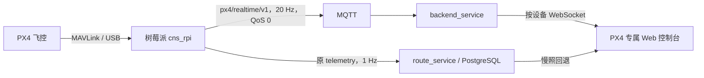

# PX4 Web 实时遥测协议

## 目标

在不改变主控箱遥测、数据库和控制协议的前提下，为真实 PX4 飞控增加一条低延迟、
允许丢旧帧的 Web 实时遥测链路。



## 配置

`px4_realtime` 是可选配置段。旧配置没有该段时，默认只对
`flight_controller` 开启 50 ms（20 Hz）发布：

```json
{
  "px4_realtime": {
    "enabled": true,
    "publish_interval_ms": 50
  }
}
```

- 合法周期：20–1000 ms。
- 该配置对 `cns_box` 不生效。
- 紧急回滚只需设置 `"enabled": false` 并重启 `cns-rpi`。
- 原 `runtime.telemetry_publish_interval_ms` 继续控制原有完整遥测，默认仍为 1000 ms。

## device_id 来源

本文所有 `{device_id}` 与载荷中的 `device_id` 均来自
`OPEN_DRONE_ID_BASIC_ID.uas_id`，与注册、常规遥测和命令路由完全一致，见
`2026-08-03-主控箱与PX4统一身份数据结构设计.md` §2.1。旧版用
`AUTOPILOT_VERSION.uid2/uid` 生成的 `PX4U2-*`/`PX4U1-*` 已废弃，服务端迁移期
不得把新旧两种 ID 自动合并成同一台设备。

高频实时遥测和 RTT 探测各自有独立的 `schema_version`，只换 `device_id` 的取值
来源，不因统一身份改动而升版本（同上，§5.2）。

## MQTT topic

```text
cns_rpi/{device_id}/px4/realtime/v1
```

- QoS：0
- retain：false
- 不重传旧帧
- 不属于 `cns_rpi/+/telemetry`，因此原 `route_service` 不会消费或写数据库

### 真实 RTT 探测

```text
cns_rpi/{device_id}/px4/latency/probe/v1
cns_rpi/{device_id}/px4/latency/ack/v1
```

两个 topic 均为 QoS 0、retain false。树莓派仅在真实飞控模式订阅 `probe`，校验
`schema_version`、`device_id`、`session_id` 和 `probe_id` 后原样返回 ACK：

```json
{
  "schema_version": 1,
  "device_id": "PX4RID123456789ABCDE",
  "session_id": "session_test",
  "probe_id": "00000000-0000-4000-8000-000000000001"
}
```

探测不进入遥测状态、不触发控制命令、不写 PostgreSQL。浏览器使用同一个
`performance.now()` 时钟测量完整应用层往返，因此不要求三端时钟同步。

## JSON

```json
{
  "schema_version": 1,
  "device_id": "PX4RID123456789ABCDE",
  "sequence": 42,
  "sent_at": "2026-07-30T07:00:00.123Z",
  "telemetry": {
    "attitude": {},
    "gps": {},
    "global_position": {},
    "sys_status": {},
    "battery": {},
    "pressure": {}
  }
}
```

字段沿用原完整遥测中的单位和嵌套结构。未收到的 MAVLink 消息不输出对应字段。
高频帧不重复携带身份、模块、告警、日志和 5G 状态；Web 页面将其与原有 1 Hz
慢照合并。

## 性能原则

- PX4 模式下串口等待从 100 ms 缩短为 5 ms；主控箱仍保持原等待策略。
- 发布过程不读取 5G 状态文件，不写数据库。
- 服务器和浏览器遇到积压时丢弃旧帧，只展示最新帧。
- 高频帧的 `sent_at` 继续用于排障；页面正式延时指标使用真实 RTT，不做跨机器时钟相减。

## 验证

```bash
cmake -S . -B build
cmake --build build -j2
ctest --test-dir build --output-on-failure
```

运行后查看：

```bash
journalctl -u cns-rpi -f
```

应出现 `PX4实时遥测已启用`，并包含周期和 topic。
