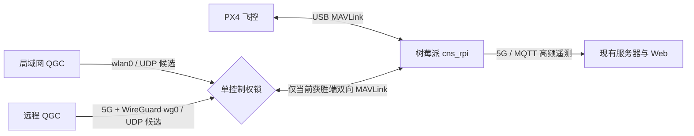
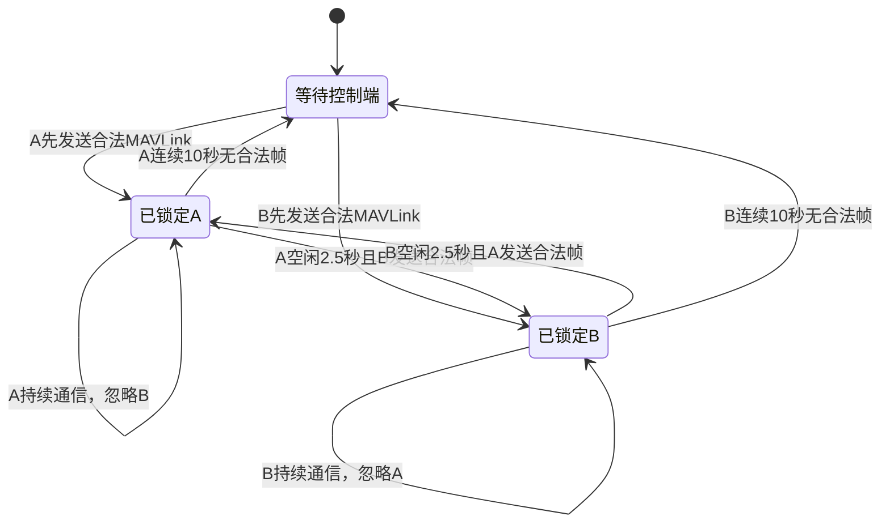

# QGC 局域网与 5G 双入口单控制权方案

日期：2026-07-31

适用分支：`new3`

适用设备：一台树莓派只连接一台 PX4 飞控

## 1. 结论

局域网 QGC 和远程 5G/WireGuard QGC 可以同时打开，但任何时刻只允许一台 QGC
向飞控双向通信。系统不预设哪一台优先：第一个向树莓派发送完整、CRC 正确 MAVLink
帧的 QGC 自动获得控制权；另一台在控制权释放前不能控制飞控。

这项改动只扩展树莓派的 QGC UDP 支路，不改变飞控串口、身份解析、Remote ID、
5G/MQTT、服务器数据库和 Web 上报链路。

## 2. 数据流



注意：5G 是 WireGuard 的承载网络。`wg0` 是安全控制入口；`usb0` 只是物联卡公网
出口，不能直接加入 QGC 允许接口。

## 3. 自动抢占规则

配置策略为：

```json
{
  "qgc_udp": {
    "enabled": true,
    "mode": "auto_discovery",
    "lan_interfaces": ["wlan0", "wg0"],
    "peer_policy": "first_valid_wins",
    "listen_port": 14540,
    "qgc_port": 14550,
    "discovery_interval_ms": 1000,
    "handover_idle_ms": 2500,
    "peer_timeout_ms": 10000,
    "allow_commands": true
  }
}
```

状态转换如下：



- “先打开软件”不等于获得控制权，真正判定依据是第一帧合法 MAVLink 到达时间。
- 当前端持续通信时不支持强制踢掉它，避免飞行中无故切换。
- 当前 QGC 关闭链路或切换网络后，另一入口约 2.5 秒即可自动接管。
- 两个入口都不发送合法帧时，10 秒后彻底释放控制权并恢复发现。
- 第二台可能短暂看到发现心跳，但不会收到持续遥测，也不能向飞控下发指令。

## 4. 两台 QGC 的配置

### 4.1 局域网 QGC

QGC 电脑与树莓派连接到同一个局域网：

1. 保持 QGC 的 UDP AutoConnect 开启；
2. 不要求写死树莓派 WLAN 地址；
3. 树莓派通过 `wlan0` 定向广播发现心跳；
4. QGC 回包后自动参加控制权竞选。

如果所在网络禁用了广播，可在 QGC 新建 UDP Link，Server Address 填树莓派当前
WLAN 地址，目标端口填 `14540`。

### 4.2 远程 5G/WireGuard QGC

1. Windows 先启用现有 `PX4-5G` WireGuard 隧道；
2. 确认可以 `ping 10.66.0.2`；
3. QGC UDP Link 的本地监听端口使用 `14550`；
4. Server Address 使用 `10.66.0.2:14540`；
5. 打开链接后，QGC 主动发送 MAVLink 帧参加竞选。

QGC 不直接连接云服务器，也不直接连接物联卡公网 IP；其 MAVLink 路径是：

```text
QGC → WireGuard(10.66.0.3) → 云服务器转发 → 树莓派(10.66.0.2) → PX4
```

## 5. 运行日志

服务启动后应出现：

```text
QGC UDP单控制权桥接已启动: listen=14540 qgc=14550 interfaces=wlan0,wg0 policy=first_valid_wins handover_idle_ms=2500 commands=enabled
```

有 QGC 获得控制权：

```text
QGC控制端已锁定: 10.66.0.3:14550
```

控制端超时并释放：

```text
QGC控制权已释放，恢复双入口竞选: 10.66.0.3:14550
```

局域网与 WireGuard 之间快速切换：

```text
QGC控制端已自动切换: 192.168.10.110:14550 -> 10.66.0.3:14550
```

实时查看：

```bash
sudo journalctl -u cns-rpi -f
```

## 6. 验收方法

1. 同时打开局域网 QGC 和远程 WireGuard QGC。
2. 观察日志，确认只记录一个“控制端已锁定”。
3. 在获胜 QGC 查看实时姿态、参数和任务；确认正常。
4. 在另一台 QGC 尝试操作；确认不能影响飞控。
5. 关闭获胜链路并开启另一入口，等待约 2.5 秒。
6. 确认日志出现“控制端已自动切换”，且另一入口恢复完整参数和遥测。
7. 全程观察 Web 高频遥测，确认 MQTT/Web 不受 QGC 切换影响。

## 7. 安全边界

- 只有配置列出的 `wlan0`、`wg0` 子网来源可参加竞选。
- 所有入站数据必须先通过 MAVLink 帧完整性与 CRC 校验。
- `wg0` 依赖 WireGuard 密钥认证和加密；`usb0` 不直接监听公网控制。
- 单控制权避免两台 QGC 同时执行解锁、校准、参数修改或航线上传。
- 该锁是网络端点锁，不是飞行安全认证替代品。实际飞行仍应配置 PX4 failsafe、
  地理围栏、返航和人工接管措施。

## 8. 回滚

只关闭远程入口、保留局域网：

```json
"lan_interfaces": ["wlan0"]
```

只保留远程 WireGuard：

```json
"lan_interfaces": ["wg0"]
```

完全关闭 QGC UDP 桥接：

```json
"qgc_udp": {
  "enabled": false
}
```

修改后重启并检查：

```bash
sudo systemctl restart cns-rpi
systemctl is-active cns-rpi
sudo journalctl -u cns-rpi -n 50 --no-pager
```
