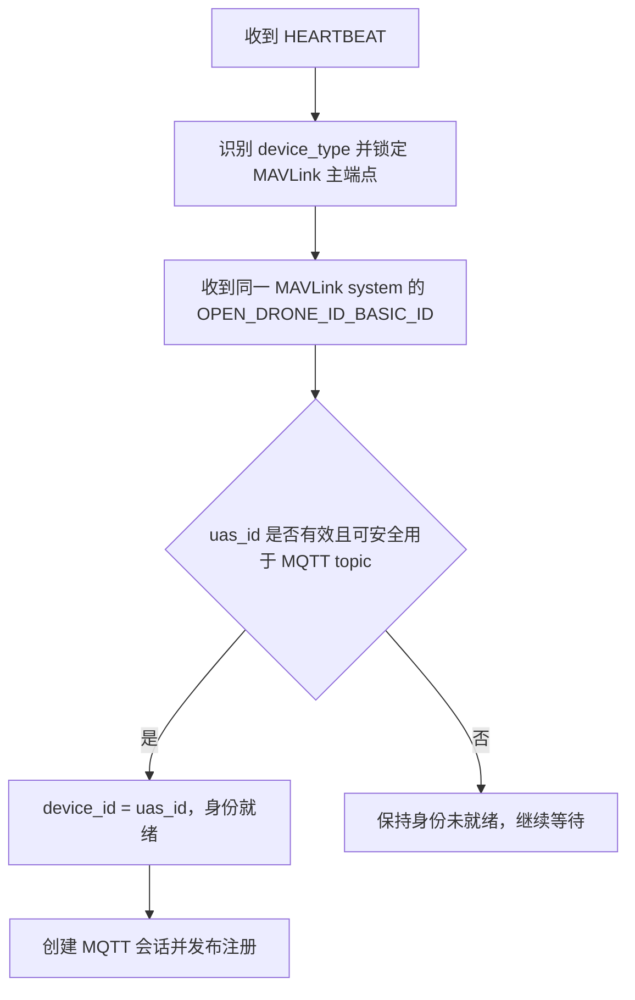

# 主控箱与 PX4 统一身份数据结构设计

版本：2026-08-03

状态：待审阅

适用范围：`cns_rpi`、`cns_server`、设备管理前端

本文档取代 `docs/2026-07-29-主控箱与PX4单设备兼容接入设计.md` 中关于
`device_id` 来源、PX4 `uid/uid2` 主键和树莓派 `gateway_id` 的设计。设备识别、
遥测兼容、QGC 桥接和命令适配等未被本文修改的内容继续沿用原设计。

---

## 1. 目标

同一套树莓派程序一次只连接一个受控设备，受控设备可能是 CNS 主控箱或 PX4
飞控。两类设备必须使用同一种身份获取方式和同一套服务端数据结构，避免同时维护
`device_id`、`vendor_id`、`remote_id`、`uid`、`uid2` 和 `gateway_id` 等多套编号。

本次设计遵循以下原则：

1. 平台管理的是当前受控设备，不是树莓派，也不是 PX4 飞控板本身；
2. 主控箱和 PX4 都从 `OPEN_DRONE_ID_BASIC_ID.uas_id` 提供受控设备身份；
3. Remote ID 模块只负责把身份广播出去，不是树莓派身份数据的唯一来源；
4. 树莓派只承担 MAVLink 与 MQTT 网关职责，不拥有业务身份；
5. 产品及版本信息与唯一身份分开建模。

---

## 2. 统一身份结论

### 2.1 唯一业务主键

主控箱和 PX4 统一采用：

```text
OPEN_DRONE_ID_BASIC_ID.uas_id -> device_id
```

`device_id` 是平台中唯一的受控设备主键，用于：

- MQTT Client ID 的设备唯一部分；
- MQTT topic 寻址；
- 设备注册、在线状态和遥测归属；
- 服务器数据库主键；
- 命令目标和审计记录关联。

主控箱原来的厂商唯一产品识别码本身就是其 Remote ID，因此旧 `vendor_id` 的值
直接成为 `device_id`，不再额外输出 `vendor_id` 或 `remote_id`。

PX4 同样使用其发送的 `OPEN_DRONE_ID_BASIC_ID.uas_id` 作为 `device_id`。
`AUTOPILOT_VERSION.uid2/uid` 表示飞控硬件 UID，不再作为设备主键，也不参与
MQTT topic、服务器路由或认证。

### 2.2 设备类型

`device_type` 只表示受控设备类别，不属于另一套身份：

| 值 | 含义 |
|---|---|
| `cns_box` | CNS 主控箱 |
| `flight_controller` | PX4 飞控 |

设备类型继续根据已确认的 HEARTBEAT 特征或配置强制模式识别，不根据
`device_id` 前缀推断。

### 2.3 明确删除的身份字段

以下字段从对外注册和遥测协议中删除：

| 字段 | 删除原因 |
|---|---|
| `vendor_id` | 对主控箱与 `device_id` 重复，对 PX4 不适用 |
| `remote_id` | 与统一后的 `device_id` 重复 |
| `uid`、`uid2` | 标识 PX4 飞控硬件，不是平台管理对象的业务主键 |
| `gateway_id` | 树莓派不参与设备身份认证或业务寻址 |
| `rpi_serial` | `gateway_id` 的本地来源，不再需要采集和存储 |

树莓派更换、维修或重装系统不能改变受控设备的 `device_id`。同一树莓派换接另一台
受控设备时，服务器只观察到旧 `device_id` 离线和新 `device_id` 上线。

### 2.4 仍保留但不属于业务身份的字段

| 字段 | 用途 | 是否进入服务器主键 |
|---|---|---:|
| `dcdw_label` | 主控箱校内角色号，例如 `DCDW-007` | 否 |
| `school_name` | 主控箱所属学校 | 否 |
| MAVLink `sysid/compid` | 当前串口会话的链路端点 | 否 |
| `schema_version` | JSON 协议版本 | 否 |
| `id_type/ua_type` | Open Drone ID 标准字段 | 否 |

`sysid/compid` 只在树莓派内部用于消息过滤、命令寻址和 ACK 配对。服务器不需要
依赖它们完成任何业务操作，因此新的注册和遥测 JSON 不再输出 `endpoint` 对象。

---

## 3. 身份获取流程



### 3.1 Basic ID 接收范围

树莓派只接受与当前已锁定受控设备具有相同 MAVLink `system_id` 的
`OPEN_DRONE_ID_BASIC_ID`。消息可以来自该 system 内的飞控组件或 Remote ID
组件，不要求 `component_id` 与 HEARTBEAT 主端点相同。

来自其他 `system_id` 的 Basic ID 不得写入当前设备状态，避免同一链路上的其他
MAVLink 系统污染身份。

### 3.2 `uas_id` 提取和校验

`uas_id` 按 MAVLink 定义读取最多 20 字节，并在第一个空字节处结束。有效值必须：

- 非空；
- 长度不超过 20 字节；
- 只包含 ASCII 字母、数字、连字符、下划线、点或冒号；
- 不包含 MQTT topic 通配符 `+`、`#` 或分隔符 `/`；
- 与 MQTT Client ID 前缀组合后满足现有长度限制。

主控箱可以在此通用校验之后继续校验 `DCDWCNS1` 产品前缀，以尽早发现固件身份
配置错误；前缀不用于判断 `device_type`。

### 3.3 身份就绪前的行为

在尚未收到合法 Basic ID 时：

- 树莓派继续发现串口、解析 HEARTBEAT 和遥测；
- PX4 的 QGC 本地桥接可以继续工作；
- 不创建按设备寻址的 MQTT Client；
- 不发布注册、遥测或命令 ACK；
- 日志按限频策略提示“等待受控设备 Basic ID”。

系统不使用 PX4 `uid/uid2`、树莓派序列号或 MAVLink `sysid` 生成临时主键。

### 3.4 会话内身份冲突

当前串口会话中首次通过校验的 `device_id` 被锁定。随后如果同一 system 上报不同的
合法 `uas_id`，树莓派不得静默切换 topic，应当：

1. 发布当前设备 retained offline（MQTT 可用时）；
2. 关闭当前 MQTT 会话；
3. 清空当前受控设备身份和遥测状态；
4. 记录身份冲突错误；
5. 重新进入设备发现和身份识别流程。

串口断开或合法 MAVLink 帧长时间静默时沿用相同的会话清理原则。

---

## 4. 产品与版本信息

产品信息和版本信息不是唯一身份，不参与 MQTT topic 或数据库主键。

### 4.1 统一结构

```json
{
  "product": {
    "manufacturer_code": "DCDW",
    "model_code": "CNS1"
  },
  "version": {
    "hardware": "可选字符串",
    "firmware": "可选字符串"
  }
}
```

所有编码统一序列化为字符串，避免主控箱文本代码与 PX4 数字代码在同一字段上产生
JSON 类型分叉。未知字段直接省略，不输出空字符串或伪造默认值。

### 4.2 主控箱映射

主控箱 `device_id` 的既有结构为：

```text
DCDW | CNS1 | 12 位序列号
厂商   产品型号   唯一序列
```

因此当前至少能够提供：

```json
{
  "product": {
    "manufacturer_code": "DCDW",
    "model_code": "CNS1"
  }
}
```

`CNS1` 是产品型号代码，不是设备唯一 ID，也不是固件版本号。主控箱以后如果通过
标准或私有 MAVLink 消息提供硬件、固件版本，再补入 `version`，但不改变
`device_id`。

### 4.3 PX4 映射

PX4 继续响应或由树莓派主动请求 `AUTOPILOT_VERSION`，但该消息只用于提取产品与
版本元数据：

| MAVLink 字段 | JSON 字段 |
|---|---|
| `vendor_id` | `product.manufacturer_code`，十进制字符串 |
| `product_id` | `product.model_code`，十进制字符串 |
| `board_version` | `version.hardware`，十进制字符串 |
| `flight_sw_version` | `version.firmware`，格式化为语义版本字符串 |
| `uid2/uid` | 忽略，不进入状态和 JSON |

未收到 `AUTOPILOT_VERSION` 不阻止设备建立 MQTT 会话。收到或更新版本信息后，
树莓派重新发布 retained online registration，使服务器幂等更新元数据。

---

## 5. MQTT 与 JSON 协议

### 5.1 Topic

两类设备继续使用同一套 topic：

```text
{namespace}/{device_id}/registration
{namespace}/{device_id}/telemetry
{namespace}/{device_id}/config/set
{namespace}/{device_id}/config/ack
{namespace}/{device_id}/control/set
{namespace}/{device_id}/control/ack
```

主控箱的 topic 字符串保持不变。PX4 的 topic 从旧设计的 `PX4U2-*`/`PX4U1-*`
切换为 Basic ID 中的 `uas_id`。

### 5.2 协议版本

本次变更会删除字段并改变 PX4 `device_id` 语义，属于不兼容变更。注册与常规遥测的
`schema_version` 从 `2` 升级为 `3`。PX4 高频实时遥测和 RTT 探测各自已有独立协议
版本，其载荷中的 `device_id` 同步改用 Basic ID，但不因本次字段整理自动升级其
`schema_version`。

### 5.3 在线注册示例

主控箱：

```json
{
  "schema_version": 3,
  "device_id": "DCDWCNS1S2MEAG1VTA0C",
  "device_type": "cns_box",
  "status": "online",
  "capabilities": [
    "telemetry",
    "remote_id",
    "runtime_config",
    "box_private_control"
  ],
  "school_name": "SEU",
  "dcdw_label": "DCDW-001",
  "product": {
    "manufacturer_code": "DCDW",
    "model_code": "CNS1"
  }
}
```

PX4：

```json
{
  "schema_version": 3,
  "device_id": "PX4RID123456789ABCDE",
  "device_type": "flight_controller",
  "status": "online",
  "capabilities": [
    "telemetry",
    "remote_id",
    "px4_official_control"
  ],
  "product": {
    "manufacturer_code": "26",
    "model_code": "7"
  },
  "version": {
    "hardware": "42",
    "firmware": "1.17.3"
  }
}
```

注册消息不再包含 `identity`、`endpoint` 或带树莓派身份的 `gateway` 对象。树莓派
程序版本和 5G 连接方式属于运行诊断信息，如果服务器确有需求，应放入独立的
`runtime` 或链路状态结构，不得重新引入 `gateway_id`。

### 5.4 离线注册

```json
{
  "schema_version": 3,
  "device_id": "PX4RID123456789ABCDE",
  "device_type": "flight_controller",
  "status": "offline"
}
```

离线注册只携带定位 retained 状态所必需的字段，不用空值覆盖服务器已有元数据。

### 5.5 常规遥测骨架

```json
{
  "schema_version": 3,
  "device_id": "PX4RID123456789ABCDE",
  "device_type": "flight_controller",
  "sent_at": "2026-08-03T10:00:00Z",
  "telemetry": {},
  "drone_id": {
    "basic_id": {
      "id_type": 1,
      "ua_type": 2
    }
  }
}
```

`drone_id.basic_id` 继续保留标准属性 `id_type` 和 `ua_type`，但删除重复的
`uas_id`；完整身份只在顶层 `device_id` 出现一次。其他 `OPEN_DRONE_ID_*`
运行数据继续按现有 `drone_id` 结构上传。

---

## 6. 树莓派内部数据结构

身份状态收敛为：

```cpp
struct DeviceIdentity {
  device::Type type;
  std::string device_id;
  std::optional<std::string> school_name;
  std::optional<std::string> dcdw_label;
  std::optional<ProductInfo> product;
  std::optional<VersionInfo> version;
};
```

`StateStore` 中删除：

- `vendor_id` 及其更新接口；
- `rpi_serial` 及其更新接口；
- 使用 `uid/uid2` 生成 PX4 `device_id` 的状态与函数。

MAVLink 主端点仍作为设备会话状态保存，但不属于 `DeviceIdentity`，也不序列化到
服务器 JSON。`AUTOPILOT_VERSION` 可以在解码后直接转换为精简的产品与版本结构，
不必长期保存包含 `uid/uid2` 的完整 MAVLink 结构体。

---

## 7. 服务器影响

服务器内部只维护一个受控设备主键 `device_id`：

1. `devices.device_id` 继续作为主键；
2. 删除或停止写入 `vendor_id`、`remote_id`、`gateway_id`、PX4 `uid/uid2`；
3. `device_type` 决定主控箱专属字段和命令能力，不决定主键来源；
4. `school_name` 和 `dcdw_label` 对主控箱按现有规则维护，对 PX4 允许缺失；
5. 产品与版本元数据从 retained registration 幂等更新；
6. 命令路由、在线状态、遥测归档和 Web 查询全部以 topic 中的 `device_id` 关联；
7. `sysid/compid` 不入业务数据库，不参与服务端命令寻址。

如果服务器已经接收过 `new2` 的 schema v2 PX4 数据，升级时需要：

- 同时接受 schema v2 和 v3，内部统一转换为 v3 领域模型；
- 将新的 Basic ID `device_id` 视为权威设备记录；
- 不自动把旧 `PX4U1-*`/`PX4U2-*` 与新 ID 合并，除非有明确的人工映射；
- 清理或标记旧 PX4 retained registration，避免页面长期显示两个在线身份；
- 迁移窗口结束后再停止接受 schema v2。

树莓派序列号移除后不会降低现有认证强度，因为上报载荷中的自报字段本来不能证明
消息来源。以后引入 MQTT TLS、账号或 ACL 时，应直接约束可发布的 `device_id`
topic，不重新使用树莓派序列号作为业务身份。

---

## 8. 兼容性与实施边界

### 8.1 保持不变

- HEARTBEAT 设备类型识别；
- 主控箱与 PX4 二选一连接；
- 串口自动发现和断线恢复；
- 通用 MAVLink 遥测解码；
- 主控箱私有遥测与命令；
- PX4 官方命令、QGC 桥接、实时遥测和 RTT 探测；
- registration retained online/offline 机制。

### 8.2 本次需要同步修改

- 树莓派身份解析、状态存储和 MQTT 建连条件；
- 注册、常规遥测、PX4 实时遥测和 RTT 载荷中的 `device_id`；
- JSON schema 及单元测试；
- `cns_server` 注册解析、数据库模型和路由字段；
- Web 接口和页面中旧 PX4 UID 主键的展示；
- `V1设计文档.md`、PX4 接入设计、设备标识符和相关协议文档。

### 8.3 不在本次范围

- 改造 Remote ID 无线广播链路；
- 为未配置 Basic ID 的 PX4 生成临时身份；
- 自动判断飞控是否被换装到另一架飞机；
- MQTT TLS、证书和 ACL 的具体实现；
- 同一树莓派同时连接主控箱和 PX4。

---

## 9. 验收标准

1. 主控箱和 PX4 都只有收到合法 `OPEN_DRONE_ID_BASIC_ID.uas_id` 后才建立设备
   MQTT 会话；
2. 两类设备的 MQTT topic、注册、遥测和命令路由均使用同一个 `device_id`；
3. 对外 JSON 不再以字段键形式出现 `vendor_id`、`remote_id`、`uid`、`uid2`、
   `gateway_id`、`rpi_serial` 或 `endpoint`；能力列表中的 `remote_id` 仍表示设备
   支持 Remote ID 功能；
4. `drone_id.basic_id` 不重复输出 `uas_id`；
5. PX4 未收到 `AUTOPILOT_VERSION` 时仍可正常注册和上传遥测；
6. 收到 `AUTOPILOT_VERSION` 后只更新产品与版本元数据，不改变 `device_id`；
7. 树莓派更换或重装不改变受控设备身份；
8. 串口换接设备或身份冲突时旧设备正确离线，新身份重新建连；
9. 服务器能够以一个 `device_id` 完成注册 upsert、在线状态、遥测归档和命令路由；
10. 主控箱现有 `DCDWCNS1...` topic 字符串保持不变。
